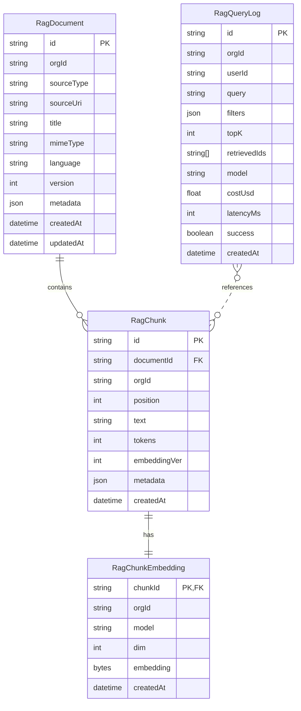

# Retrieval-Augmented Generation (RAG) Systems Blueprint

## 🎯 Overview
Design, implement, and operate robust RAG systems for production AI features. Covers retrieval strategy, chunking, embeddings, vector stores, caches, evaluation, and observability.

---

Quick links: [Database Integration](#db-integration)

## 🧱 Architecture
- Retriever abstraction (hybrid: lexical + vector)
- Indexing pipeline (ingestion → cleaning → chunking → embedding → upsert)
- Query pipeline (rewrite → retrieve → rerank → context windowing → generation)
- Caching layers (query/result, embedding, retrieval)
- Evaluation loop (offline + online)

## 📥 Ingestion & Preprocessing
- Connectors: files, URLs, CMS, DBs, APIs
- Cleaning: HTML to text, boilerplate removal, language detection
- Deduplication & doc IDs, canonical URLs
- PII scrubbing and security classification

## 🧩 Chunking Strategies
- Fixed-size tokens (e.g., 512–1024) with overlap (15–20%)
- Semantic chunking (paragraph/heading-aware)
- Hybrid: structural + token window, preserve hierarchy
- Store rich metadata: path, section, headings, timestamps, permissions

## 🔎 Embeddings & Vector Stores
- Models: OpenAI text-embedding-3-large/small or local alternatives
- Stores: PostgreSQL+pgvector, Qdrant, Weaviate, Pinecone (choose per scale & ops)
- Indexes: HNSW/IVF; tune ef_search/nlist
- Namespaces/tenancy strategy (by org/project)
- Migrations: backfill new embeddings with versioned index

## 🔍 Retrieval
- Hybrid retrieval: BM25 + vector fusion (Reciprocal Rank Fusion)
- Filters from metadata (org, tags, access control)
- Reranking: cross-encoder or LLM-based rerank on top-K (e.g., 100 → 10)
- Diversification: Maximal Marginal Relevance (MMR)
- Freshness boosting and decay

## 🧠 Context Assembly
- Budgeting: token limits, safety margin for generation
- De-dup & merge near-duplicate chunks
- Ordering: by score, section continuity, or semantic flow
- Citations: keep chunk IDs for source references

## ⚙️ Generation Orchestration
- Prompt templates with system + task + constraints
- Tool-aware prompts for citing sources
- Safety: guardrails, PII filters, jailbreak resistance
- Cost/latency policies with fallbacks

## 🗄️ Caching & Performance
- Query cache keyed by (query, filters, topK, embedModel)
- Embedding cache keyed by (textHash, model)
- Retrieval cache for popular queries (timeboxed)
- Warmup & background reindex; rate limits & backpressure

## 🔐 Security & Governance
- Row-level security: per-org/per-user filters at retrieval
- Audit logs: query, retrieved doc IDs, generation, costs
- Data retention & deletion (GDPR/right to be forgotten)
- Red-team datasets for safety testing

## 📊 Evaluation
- Offline: relevance metrics (nDCG, Recall@K, Precision@K)
- Ground truth sets: curated Q/A pairs with accepted sources
- Online: A/B tests, win-rate, user feedback loop
- Hallucination checks, citation correctness, answer groundedness

## 🧪 Testing Strategy
- Deterministic tests for ingestion/chunking/filters
- Integration tests for retrieval pipelines (fixtures with small corpora)
- Contract tests for vector store adapters
- Load tests for spike retrieval scenarios

## 🔭 Observability
- Traces across ingestion → retrieval → generation (OpenTelemetry)
- Metrics: QPS, p95 latency, cache hit rate, cost per request
- Error taxonomy: no hits, timeouts, access denied, embed failures
- Dashboards + alerts for drift and degradation

## 🗺️ Data Model (Prisma Sketch)
```prisma
model RagDocument {
  id           String   @id @default(cuid())
  orgId        String
  sourceType   String
  sourceUri    String?
  title        String?
  mimeType     String?
  language     String?
  version      Int      @default(1)
  metadata     Json?
  createdAt    DateTime @default(now())
  updatedAt    DateTime @updatedAt
}

model RagChunk {
  id           String   @id @default(cuid())
  documentId   String
  orgId        String
  position     Int
  text         String
  tokens       Int
  embeddingVer Int
  metadata     Json?
  createdAt    DateTime @default(now())
  document     RagDocument @relation(fields: [documentId], references: [id], onDelete: Cascade)
}

model RagQueryLog {
  id           String   @id @default(cuid())
  orgId        String
  userId       String?
  query        String
  filters      Json?
  topK         Int
  retrievedIds String[]
  model        String
  costUsd      Float?
  latencyMs    Int?
  success      Boolean  @default(true)
  createdAt    DateTime @default(now())
}
```

<a id="db-integration"></a>
## 🗄️ Database Integration

### ER Diagram



Two deployment options:

- Postgres with pgvector (simple ops to start)
- External vector DB (Qdrant/Weaviate/Pinecone) for larger scale

### pgvector Setup (Postgres)
- Enable extension in migrations:
  ```sql
  CREATE EXTENSION IF NOT EXISTS vector;
  ```
- Minimal embedding table sketch:
  ```prisma
  model RagChunkEmbedding {
    id         String   @id @default(cuid())
    chunkId    String   @unique
    orgId      String
    model      String
    dim        Int
    embedding  Bytes    // store vector; or use native 'vector' via SQL migration
    createdAt  DateTime @default(now())

    chunk      RagChunk @relation(fields: [chunkId], references: [id], onDelete: Cascade)

    @@map("rag_chunk_embeddings")
    @@index([orgId])
  }
  ```
- If using native `vector` type, define column via SQL migration and map with Prisma as Bytes or use a client supporting pgvector directly.

### External Vector DB
- Keep Postgres for metadata (`RagDocument`, `RagChunk`) and for `RagQueryLog`
- Store vectors in external DB keyed by stable `chunkId`

### Operational Guidance
- Namespace by `orgId` and optional `collection`
- Track re-embedding jobs and index maintenance
- Apply RLS/filters per org on metadata tables

Note: Core DB standards live in `03-database-architecture.md`. RAG-specific schemas and ops are documented here.

## 🚀 Rollout Playbook
- Start with hybrid retrieval + pgvector
- Build goldenset and offline eval first
- Add reranker only if needed (measure!)
- Ship with solid observability and rollback
- Iterate on chunking + metadata quality

## ✅ Success Metrics
- Relevance: nDCG@10 ≥ target, Recall@50 ≥ target
- Cost: <$X per 1k queries, p95 latency < Y ms
- Quality: hallucination rate trending down, citation correctness trending up
